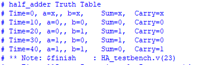

# This Repo Folder consist of Verilog Code of Binary Adder
## 1.Halff Adder
### A half adder is a digital logic circuit that performs binary addition of two single-bit binary numbers. It has two inputs, A and B, and two outputs, SUM and CARRY.

#### Fig(1) Circuit Daigram

#### Fig(2)Verilog Output Truth Table

### ModelSim-Intel® FPGAs Standard Edition Software Version 18.1 used to exxecute these code.
