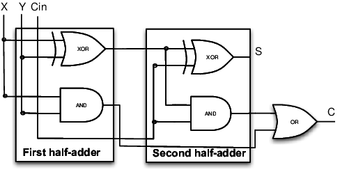
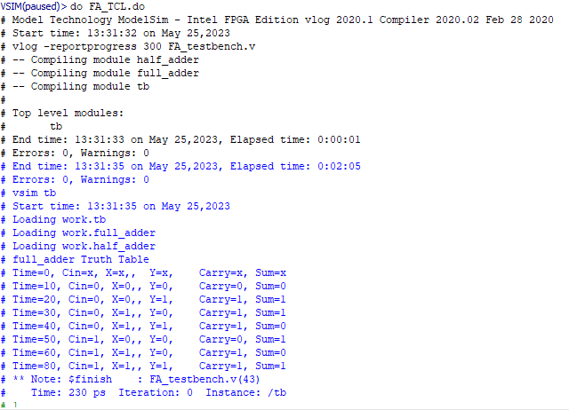

# This Repo Folder consist of Verilog Code of Binary Adder(Half Adder and Full Adder)
## 1.Halff Adder
### A Half Adder is a digital logic circuit that performs binary addition of two single-bit binary numbers. It has two inputs, A and B, and two outputs, SUM and CARRY.

#### Fig(1) Circuit Daigram

#### Fig(2)Verilog Output Truth Table
----
## 2.Full Adder
### A Full Adder is a digital logic circuit that performs binary addition of Three single-bit binary numbers. It has 3 inputs, X,Y and Carry_in(Cin), and two outputs, SUM(S) and CARRY(C).

#### Fig(3) Circuit Daigram

#### Fig(4)Verilog Output Truth Table
----
### ModelSim-Intel® FPGAs Standard Edition Software Version 18.1 used to exxecute these codes.
