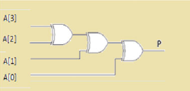
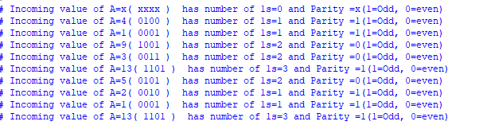

# Parity Detector:
## Parity detectors are used to detect the even or odd parity for the binary number string. For even number of 1’s, the output required is logical ‘0’ and for odd number of 1’s the output required is logical ‘1,’.

### Fig(1) 4 bit Parity Detector Circuit Diagram

### Fig(2) Verilog Output
