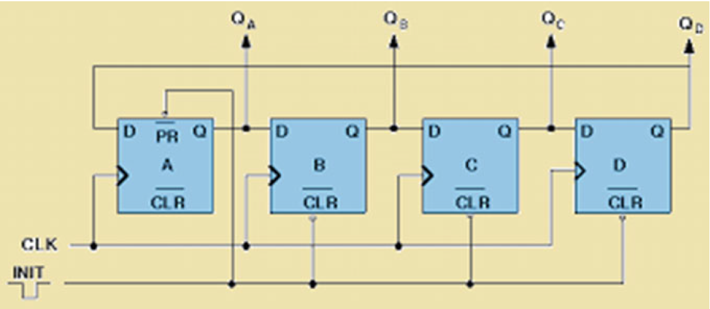

# Ring Counter
Ring counters are used in the practical applications to provide the predefined delay.These counters are synchronous in nature and used in the practical applications liketraffic light controller, timers to introduce the certain amount of predefined delay

In this Code I designed a Foubit Ring using D-FF as shown below

.
